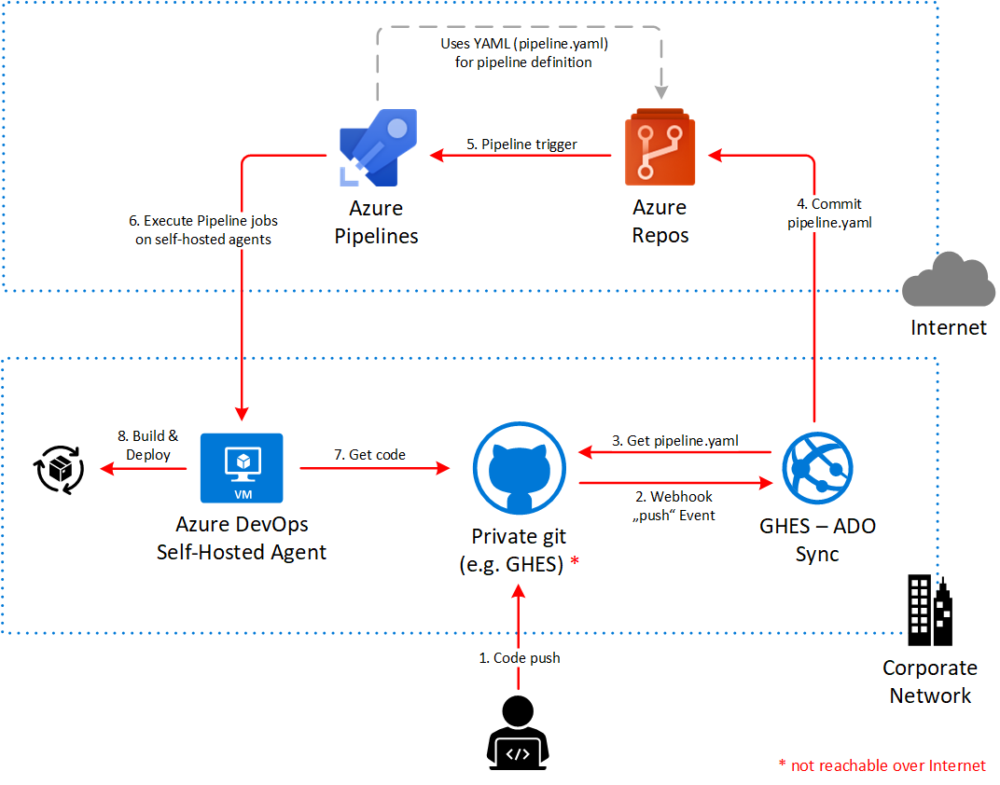

# GHES to Azure DevOps

A proof-of-concept to push a pipeline definition (pipeline.yaml) from a private GHES (GitHub Enterprise Server) repository - not reachable by Internet - to Azure DevOps Service.

An Azure Function (func-sync-trigger)  will be the webhook endpoint to receive "push" events from GHES and doing all the magic.

As an alternative, a GitHub Probot app (probot-sync) can be installed on a VM inside the private, corporate network. Following diagram illustrates the Probot approach:



## Installation & Configuration
### Probot (probot-sync)
In order to run Probot, Node.js and NPM are required. Also a GitHub App is needed, e.g. created on GHES, which is described [here](https://probot.github.io/docs/development/).

```sh
# Change directory to the probot poc
cd probot-sync

# copy .env.example to .env and adjust all necessary settings
# e.g. credentials for the Azure DevOps target repository, ...

# Install dependencies
npm install

# Run the bot
npm start
```
